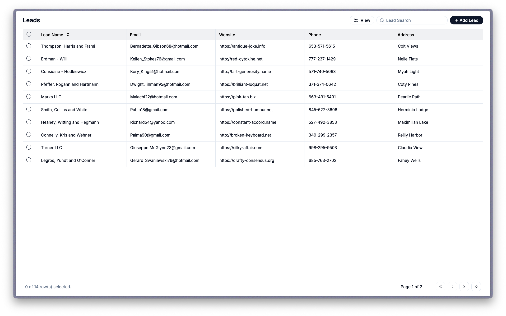

<h1 align="center">Asent Developer Challenge</h1>

### Overview

This challenge is about building real software: clean architecture, predictable data flow, solid API interaction, and a UI that feels intentional. You’ll start with a simple leads table in a Next.js app and turn it into something that feels like it belongs in a production environment.

We care just as much about *how* you build as *what* you build.
<br />

# The What?

Take the existing weird looking and raw leads view and evolve it into a robust, high-quality data experience.
<br />

<br />
### Core Requirements

| Area                  | Expectations                                                                                       |
| --------------------- | -------------------------------------------------------------------------------------------------- |
| **Interaction Layer** | Toolbar for bulk actions, filters, multi-column sorting, inline editing, smooth user interactions. |
| **Data Model & API**  | Extend the Lead schema, implement full CRUD, design predictable request behavior.                  |
| **State & Logic**     | Caching, refresh controls, optimistic updates (where appropriate), good error/loading handling.    |
| **Performance**       | Virtualization for large datasets, efficient renders, sensible memoization.                        |
| **UX Polish**         | Clean layout, consistent feedback, small quality-of-life touches.                                  |
| **Code Quality**      | Clear components, solid TypeScript, maintainable structure.                                        |

## What we are looking for

We want to see how you think and how you build. Can you break a messy problem into clean pieces, choose an architecture that actually makes sense, and know when performance matters instead of randomly over-engineering? Can you design something that works end to end, handles real-world edge cases, and feels good for actual users? Most importantly, can you explain your decisions clearly instead of hiding behind buzzwords.
<br />

# Getting Started

### 1. Fork the repository

Create your own fork of the project on GitHub.

### 2. Clone your fork

```bash
git clone https://github.com/asentapp/grids.git
cd grids

```

### 3. Install dependencies

```bash
npm install

# or 

pnpm install

# or

bun install
```

### 4. Set up MockAPI

Create a `leads` resource with at least:

```tsx
interface Lead {
  id: string;
  company: string;
  email: string;
  website: string;
  address: string;
  phone: string;
  // Add your extended fields here
}

```

Take a look at `.env.example` and add your endpoint to `.env.development.local` 

```
MOCKAPI_URL=https://YOUR_PROJECT_ID.mockapi.io/leads
```

### 5. Run the project

```bash
npm run dev

# or 

pnpm run dev

# or

bun run dev
```
<br />

# How to Submit

Keep it simple:

1. **Fork the repo**
2. **Build your solution directly on your fork**
3. **Record a 5–10 minute walkthrough video** explaining:
    - Your architecture decisions
    - How your system works
    - Any trade-offs or limitations
    - A demo of the finished features
4. **Push all your code to your fork**
5. **Put the video link here : _________________ (edit the** `README.md`**)**
6. **Send us the link to your GitHub fork + your video**

No branches, no PRs. Your fork *is* your submission.
